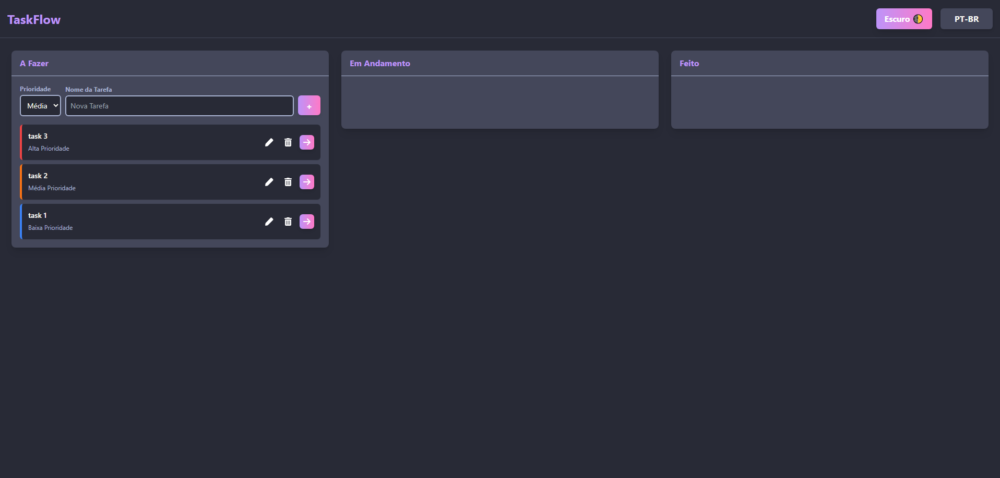
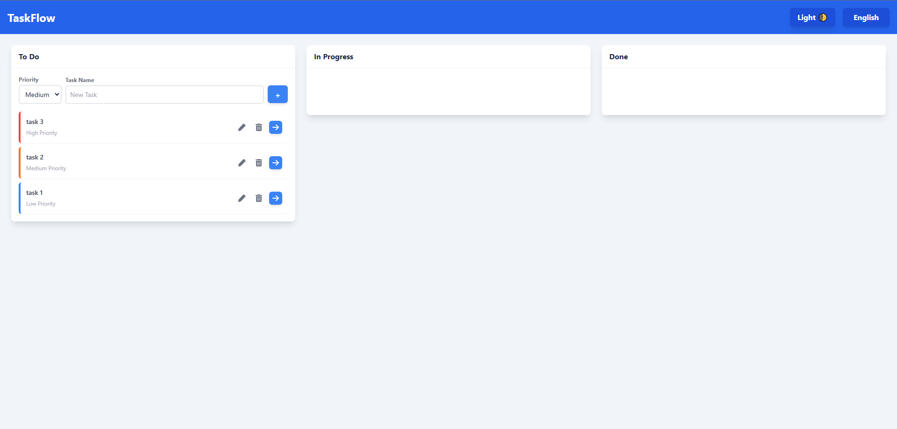
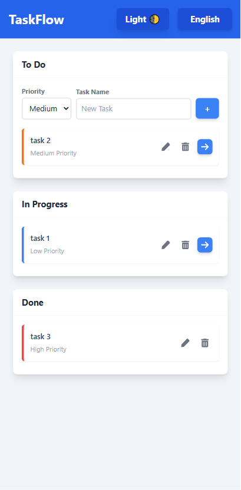

# 🚀 TaskFlow

> Um gerenciador de tarefas moderno, responsivo e com suporte a Drag & Drop.


## 🖼️ Preview do Projeto

<div align="center">
  
</div>

<div align="center">
  <table>
    <tr>
        <td align="center" width="50%">
        <strong>Web</strong>
        <br>
        
      </td>
       <td align="center" width="50%">
        <strong>Light mode</strong>
        <br>
        
      </td>
    </tr>
    <tr>
        <td align="center" width="50%">
        <strong>Mobile</strong>
        <br>
        
      </td>
       <td align="center" width="50%">
        <strong>Dark Mode</strong>
        <br>
        
    </tr>
    </table>
</div>

## 💻 Sobre o Projeto

O **TaskFlow** é uma aplicação de gerenciamento de tarefas. O objetivo foi criar uma solução para organização pessoal, focando em uma experiência de usuário fluida (UX) e código limpo.

O projeto foi desenvolvido para consolidar conhecimentos avançados em **React**, **Gerenciamento de Estado** e **Bibliotecas de Interface**.

---

## ✨ Funcionalidades

- **📋 Quadro Interativo:**
  - Arraste e solte tarefas entre colunas (To Do, In Progress, Done).
  - Ordenação automática por prioridade (Alta > Média > Baixa).
  
- **🎨 Design & UX:**
  - **Dark Mode:** Tema Dracula integrado para conforto visual.
  - **Responsividade:** Layout adaptável para Desktop e Mobile.
  - **Feedback Visual:** "Fantasmas" ao arrastar cards e animações suaves.

- **🌐 Internacionalização (i18n):**
  - Suporte completo para **Inglês** e **Português (BR)**.
  - Troca de idioma instantânea sem recarregar a página.

- **⚙️ Funcionalidades Técnicas:**
  - **CRUD Completo:** Criar, Ler, Editar e Deletar tarefas.
  - **Persistência de Dados:** Uso de `localStorage` para não perder tarefas ao atualizar.

---

## 🛠️ Tecnologias Utilizadas

O projeto foi desenvolvido utilizando as melhores práticas do ecossistema React:

- **[React](https://reactjs.org/)** - Biblioteca para construção da interface.
- **[Vite](https://vitejs.dev/)** - Build tool ultrarrápida.
- **[Tailwind CSS](https://tailwindcss.com/)** - Estilização utility-first (incluindo Dark Mode).
- **[@dnd-kit](https://dndkit.com/)** - Biblioteca moderna e acessível para Drag & Drop.
- **Context API** - Gerenciamento de estado global (Tema e Idioma) sem Redux.

---

## 🚀 Como rodar o projeto

Pré-requisitos: Você precisa ter o [Node.js](https://nodejs.org/) instalado.

```bash
# 1. Clone o repositório
git clone https://github.com/USUARIO/To-Do.git

# 2. Entre na pasta do projeto
cd taskflow

# 3. Instale as dependências
npm install

# 4. Rode o servidor de desenvolvimento
npm run dev
